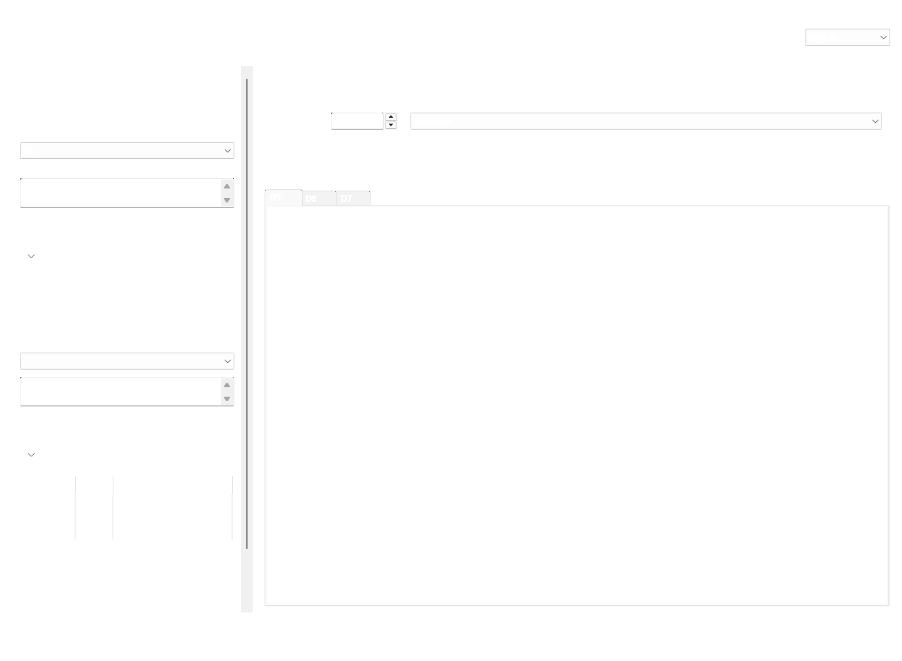

# Layout Clone for KiCad

**One placement. Multiple circuits.**

Layout Clone copies footprint placement between repeated circuits in KiCad 10.
Arrange one circuit, select its footprints, then select the equivalent target
groups. Parts are matched using footprint identity, value and pad connectivity.
Positions and orientations are transferred relative to an anchor, even when
reference numbers and local net names differ.

**0.2.0 · MIT · English and Turkish · KiCad IPC API**

[Türkçe](README.tr.md) · [Releases](https://github.com/MEY-26/kicad-layout-clone/releases) · [Issues](https://github.com/MEY-26/kicad-layout-clone/issues)

## Features

- Capture source and target footprints directly from PCB selection. Only the
  selected footprints are included; selections are never automatically expanded.
- Apply one source placement to multiple target groups in one operation.
- Match electrical roles rather than reference-number order.
- Preview mappings, positions and angles; resolve ambiguous parts explicitly.
- Add rotation or reflect footprint **centres** along the anchor's local axes.
- Remove individual targets or clear all targets while keeping the source.
- Switch language without losing selected groups or previews. The first launch
  uses English, and the chosen language is remembered.
- Apply through KiCad's native undo transaction. The board is not saved automatically.

## Installation

This community release targets **Windows and KiCad 10.0**. Tested with KiCad
**10.0.5**, Python 3.11, `kicad-python==0.7.1` and `wxPython==4.2.2`.
Linux/macOS have not been verified and are excluded from the PCM platform list.

1. Download `Layout_Clone-0.2.0-pcm.zip` from the release page.
2. In the KiCad Project Manager, open **Plugin and Content Manager**, then
   **Install from File…** and select the ZIP.
3. Enable the API server in KiCad Preferences under **Common → API**. Configure
   a Python interpreter if requested. Initial managed dependency installation
   needs internet access.
4. Open or reopen the PCB Editor and launch **Layout Clone** from its toolbar
   or plugin menu.

GitHub publication alone does not add the plugin to the default PCM catalogue.
Search installation becomes available after KiCad maintainers accept the
official metadata submission.

If upgrading from the manually installed `com.sharkesc.layout-clone` build,
back up and remove that legacy installation before installing the PCM version
to avoid duplicate toolbar entries. The community package identifier is
`com.github.mey-26.kicad-layout-clone`.

## Workflow

1. Select **all source-group footprints** in the PCB Editor. Open the plugin
   or click **1 · Capture PCB source selection**. Choose the source anchor.
2. Clear the previous PCB selection, then select all footprints in one target
   group. Click **2 · Capture and add PCB target**. If several target anchors
   are possible, choose the corresponding anchor and add the group manually.
   Repeat for more targets.
3. Click **3 · Match and preview**. Inspect each target tab. Ambiguous rows
   need a choice; the valid-proposal button can assign interchangeable parts
   consistently with the entire circuit.
4. Click **4 · Apply to all targets**. Inspect placement, run DRC, and save
   when satisfied. Use the PCB Editor's **Ctrl+Z** to undo placement.

The window stays open while you select footprints in KiCad. Manual reference
entry, saved KiCad groups and optional group suggestions are in expandable
sections. Source and target groups must have equal counts and not overlap.
Changing the source clears earlier targets and previews.

**Remove selected target** and **Remove all targets** only edit the plugin's
target list. They do not delete footprints or undo an applied placement.
The language selector is in the upper-right corner.

## Rotation and matching

At **0° additional rotation**, the target anchor keeps its position and angle.
Additional rotation rotates the group around the target anchor's centre.
Reflection changes **centres only** around the source anchor's local X or Y
axis. It does not mirror pad geometry, orientations or pin order, or flip the
board side. Inspect pin positions when using reflection.

Matching requires compatible values, footprints, reference types, pad counts
and board sides. Local net names may differ; shared nets and complete pad
connectivity must remain consistent. Reversed terminals of supported non-polar
two-pin parts receive a compensating 180° rotation. Supported four-terminal
Kelvin shunts retain paired sense and power ends.

## Limits and troubleshooting

- Only existing footprint positions and angles change. Tracks, vias, zones
  and net assignments are not copied or rerouted.
- Preview shows centres and directions, without collision or copper-clearance
  checks. Run DRC after placement.
- Locked targets are rejected. Board changes after preview require a fresh
  preview. Very large or symmetric groups may exceed matching limits.
- Writes are blocked while the schematic editor is open because of reported
  KiCad 10 IPC transaction crashes. Save the schematic and close its editor,
  keeping the PCB Editor open. See KiCad issues
  [#25322](https://gitlab.com/kicad/code/kicad/-/issues/25322) and
  [#24966](https://gitlab.com/kicad/code/kicad/-/issues/24966).
- Finish active move/drawing commands and properties dialogs before applying.
  After a connection error, inspect the board and preview again. An uncertain
  commit response can mean placement already happened.
- After an update, close and relaunch the plugin window. If the button is
  missing, reopen the PCB Editor and check API/dependency settings.
- Diagnostic logs use `shark-layout-clone-error.log` in the system temporary
  folder. Review logs before sharing: they can contain board references and
  paths. Language preferences are kept outside the installation in the user's
  configuration directory.

## Development and reporting

Source: [MEY-26/kicad-layout-clone](https://github.com/MEY-26/kicad-layout-clone).
Please report KiCad/plugin versions, OS, reproduction steps and a small
shareable example. Do not upload private boards unless you intend to publish them.

The public repository includes synthetic matching and language tests, package
validation and a reproducible PCM builder. The development workspace also has
Windows wx/adapter tests; 0.2.0 passed 58 tests there, including language changes
with preview state preserved. Earlier placement builds were exercised on an
isolated real KiCad board copy. Other platforms and a new real-server placement
run specifically for 0.2.0 have not been independently verified.

MIT license: [LICENSE](LICENSE).
