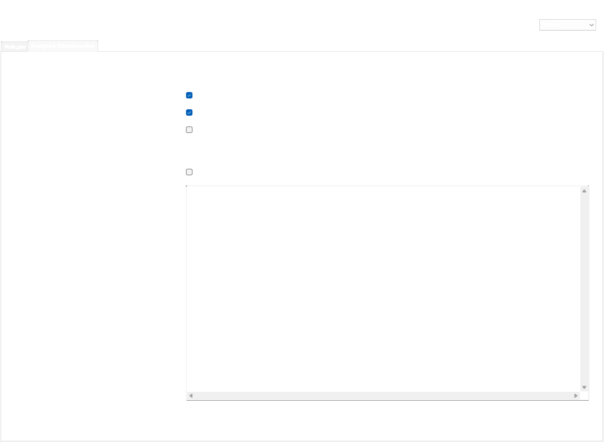

# KiCad için Layout Clone

**Bir yerleşim. Birden fazla devre.**

Layout Clone, KiCad 10'da tekrarlanan devrelerin komponent yerleşimini kopyalar.
Bir devreyi düzenledikten sonra kaynak parçaları ve karşılık gelen hedef grupları
seçersin. Parçalar kılıf, değer ve pad bağlantılarıyla eşleştirilir. Konum ve
yönler referans komponente göre aktarılır; referans numaraları ve yerel ağ
adları farklı olabilir.

**0.3.1 · MIT · İngilizce ve Türkçe · KiCad IPC API**

İki ayrı sekme bulunur: **Yerleşim** konum/açı kopyalar;
**Footprint Düzenlemeleri** hedefin konumunu, kimliğini ve ağlarını koruyarak
projeye özgü pad geometrisini ve çizimleri kopyalar.
[Yeni sekmenin kullanım ve kapsamı](FOOTPRINT_EDITS.tr.md).

[English](README.md) · [Sürümler](https://github.com/MEY-26/kicad-layout-clone/releases) · [Hata bildir](https://github.com/MEY-26/kicad-layout-clone/issues)

## Özellikler

- **Footprint Düzenlemeleri** ile projeye özgü pad geometrisi, çizimler ve isteğe
  bağlı referans/değer biçimi kopyalanır; karşı yüz dönüşümü de desteklenir.
- Kaynak ve hedefler PCB üzerinden alınır. Yalnız seçili komponentler
  dahil edilir; seçim otomatik genişletilmez.
- Bir kaynak yerleşim tek işlemde birden fazla hedefe uygulanabilir.
- Eşleştirme referans numarası sırasına değil, elektriksel bağlantılara dayanır.
- Eşleşmeler, konum ve açılar önizlenir; belirsiz parçalar açıkça seçilir.
- Ek dönüş yapılabilir; komponent **merkezleri** referansın yerel eksenlerinde
  yansıtılabilir.
- Hedefler tek tek veya topluca kaldırılırken kaynak korunur.
- Dil, seçili gruplar ve önizleme korunarak değişir. İlk açılış İngilizcedir;
  daha sonra seçilen dil hatırlanır.
- KiCad'in yerel geri alma işlemi kullanılır. Kart otomatik kaydedilmez.

## Kurulum

Bu topluluk sürümü **Windows ve KiCad 10.0** içindir. KiCad **10.0.5**,
Python 3.11, `kicad-python==0.7.1` ve `wxPython==4.2.2` ile sınandı.
Linux/macOS doğrulanmadığından PCM platform listesinde bulunmuyor.

1. [Sürüm sayfasından](https://github.com/MEY-26/kicad-layout-clone/releases/tag/v0.3.1) `Layout_Clone-0.3.1-pcm.zip` dosyasını indir.
2. KiCad Proje Yöneticisi'nde **Plugin and Content Manager** bölümünü aç;
   **Install from File…** ile ZIP'i seç.
3. KiCad Tercihleri'nde **Common → API** altındaki API sunucusunu etkinleştir.
   İstenirse Python yorumlayıcısını ayarla. İlk bağımlılık kurulumu için
   internet gerekir.
4. PCB düzenleyicisini aç veya yeniden aç; araç çubuğundan ya da eklenti
   menüsünden **Layout Clone** eklentisini başlat.

GitHub'da yayımlanması, eklentiyi kendiliğinden varsayılan PCM kataloğuna eklemez.
Arama üzerinden kurulum, KiCad ekibinin resmi metadata başvurusunu kabul
etmesinden sonra kullanılabilir.

Önceki elle kurulan `com.sharkesc.layout-clone` sürümünden geçiyorsan PCM
sürümünü kurmadan önce eski kurulumu yedekleyip kaldır. Böylece iki araç çubuğu
düğmesi oluşmaz. Topluluk paketinin kimliği
`com.github.mey-26.kicad-layout-clone` olarak belirlendi.

## Yerleşim sekmesinin kullanımı

1. PCB'de **kaynak grubun bütün komponentlerini** seç. Eklentiyi aç veya
   **1 · PCB kaynak seçimini al** düğmesine bas. Kaynak referansını seç.
2. Önceki PCB seçimini temizleyip bir hedef grubun tüm komponentlerini seç.
   **2 · PCB hedef seçimini al ve ekle** düğmesine bas. Birden fazla uygun
   referans varsa karşılığını seçip grubu elle ekle. Diğer hedefler için tekrarla.
3. **3 · Eşleştir ve önizle** düğmesine bas. Her hedef sekmesini kontrol et.
   Belirsiz satırlarda seçim gerekir; geçerli öneri düğmesi eşdeğer parçaları
   bütün devrenin bağlantılarıyla tutarlı biçimde eşleştirebilir.
4. **4 · Tüm hedeflere uygula** düğmesine bas. Yerleşimi kontrol et, DRC
   çalıştır ve uygun olduğunda kaydet. PCB'de **Ctrl+Z** ile geri alınabilir.

Pencere açıkken PCB üzerinden seçim yapılabilir. Elle referans girişi, kayıtlı
KiCad grupları ve isteğe bağlı grup önerileri açılır bölümlerdedir. Kaynak ve
hedeflerin parça sayıları aynı olmalı ve gruplar çakışmamalıdır. Kaynağı
değiştirmek önceki hedefleri ve önizlemeleri temizler.

**Seçili hedefi kaldır** ve **Tüm hedefleri kaldır** yalnız eklentinin hedef
listesini düzenler. Komponent silmez veya uygulanmış yerleşimi geri almaz.
Dil seçimi sağ üst köşededir.

## Dönüş ve eşleştirme

Ek dönüş **0°** iken hedef referans konumunu ve açısını korur. Ek dönüş, grubu
hedef referansın merkezi etrafında döndürür. Yansıtma yalnız **merkezleri**,
kaynak referansın yerel X veya Y eksenine göre yansıtır. Pad geometrisi, yönler
ve pin sırası aynalanmaz; kart yüzü değişmez. Yansıtma kullanıldığında pin
konumları kontrol edilmelidir.

Değer, kılıf, referans türü, pad sayısı ve kart yüzü uyumlu olmalıdır. Yerel ağ
adları farklı olabilir; ortak ağlar ve tüm pad bağlantıları tutarlı kalmalıdır.
Desteklenen kutupsuz iki uçlu parçalarda ters terminal eşleşmesi 180° dönüşle
karşılanır. Desteklenen dört uçlu Kelvin şöntlerinde ölçüm ve güç uç çiftleri
birlikte değerlendirilir.

## Sınırlar ve sorun giderme

- Yerleşim sekmesinde yalnız mevcut komponentlerin konumu ve açısı değişir. İzler, via'lar,
  bölgeler ve ağ atamaları kopyalanmaz veya yeniden döşenmez.
- Önizleme merkezleri ve yönleri gösterir; çakışma veya bakır açıklığı kontrolü
  yapmaz. Yerleşimden sonra DRC gerekir.
- Kilitli hedefler reddedilir. Önizleme sonrası kart değişirse yeniden
  önizleme gerekir. Çok büyük veya simetrik gruplar eşleştirme sınırına ulaşabilir.
- KiCad 10'da bildirilen IPC işlem çökmesi nedeniyle şema düzenleyicisi açıkken
  taşıma başlatılmaz. Şemayı kaydedip yalnız şema düzenleyicisini kapat; PCB
  açık kalsın. İlgili kayıtlar:
  [#25322](https://gitlab.com/kicad/code/kicad/-/issues/25322),
  [#24966](https://gitlab.com/kicad/code/kicad/-/issues/24966).
- Uygulamadan önce aktif taşıma/çizim komutunu ve özellik penceresini bitir.
  Bağlantı hatasında kartı kontrol edip yeniden önizle. İşlem sonu yanıtı
  belirsizse yerleşim zaten uygulanmış olabilir.
- Güncellemeden sonra eklenti penceresini kapatıp tekrar aç. Düğme görünmezse
  PCB düzenleyicisini yeniden açıp API/bağımlılık ayarlarını kontrol et.
- Tanı kayıtları sistemin geçici klasöründeki `shark-layout-clone-error.log`
  dosyasına yazılır. Referanslar ve dosya yolları içerebileceğinden paylaşmadan
  önce kontrol et. Dil tercihi kurulumdan ayrı olarak kullanıcının
  yapılandırma klasöründe saklanır.

## Geliştirme ve hata bildirimi

0.3.1 deneme sürümünde yeni sekme, seçim akışı, dil değişimi ve işlem güvenliği
izole testlerle kontrol edildi. Ayrı bir KiCad 10.0.5 deneme PCB’sinde gerçek
geometri aktarımı, 37° hedef, işlem iptali, tek adımda Undo/Redo ve mevcut
yerleşim akışı doğrulandı. Canlı proje dosyaları değiştirilmedi.

Kaynak: [MEY-26/kicad-layout-clone](https://github.com/MEY-26/kicad-layout-clone).
Hata bildirirken KiCad/eklenti sürümlerini, işletim sistemini, tekrar üretme
adımlarını ve paylaşılabilir küçük bir örneği ekle. Özel kartları yayımlamak
istemiyorsan ekleme.

Yayın deposunda sentetik eşleştirme ve dil testleri, paket doğrulaması ve tekrar
üretilebilir PCM oluşturucusu var. Geliştirme çalışma alanında Windows
wx/aktarım katmanı testleri de bulunuyor. 0.3.1 geometri aktarımı, dil,
seçim ve yerleşim akışlarıyla sınandı. Diğer platformlar doğrulanmış değildir.

MIT lisansı: [LICENSE](LICENSE).
